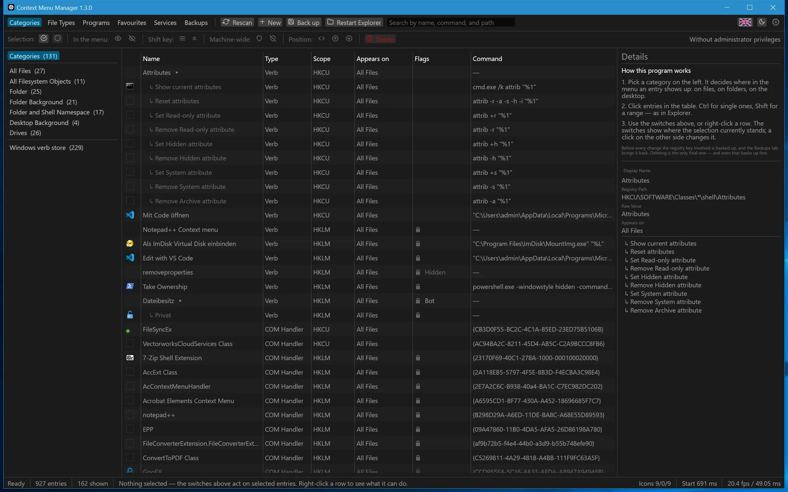
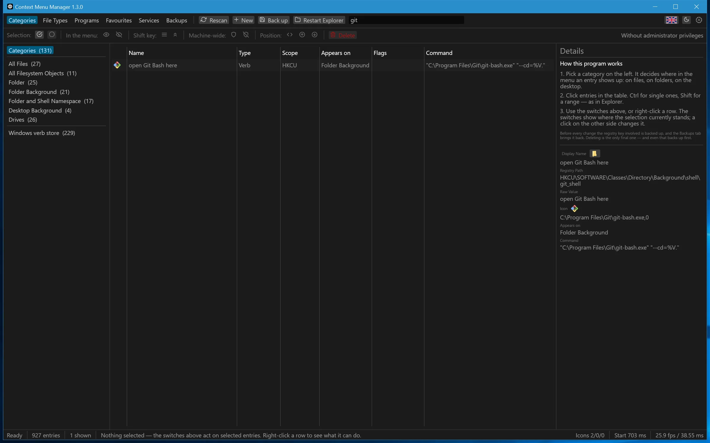
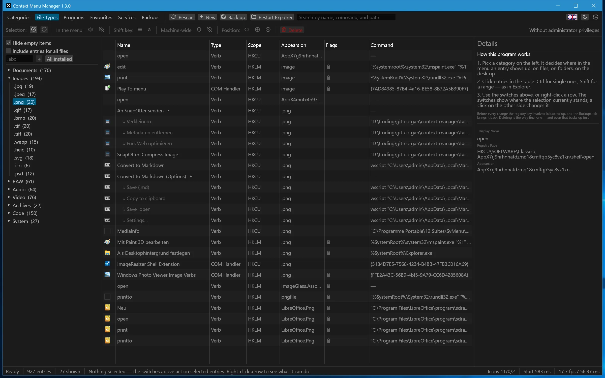
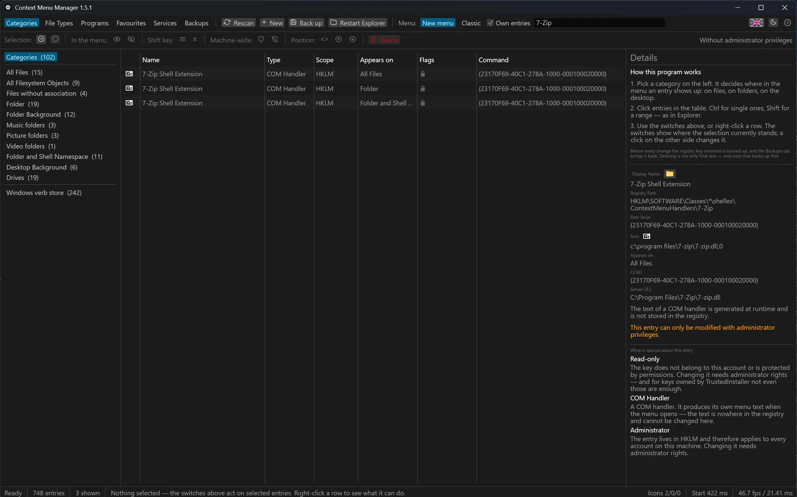
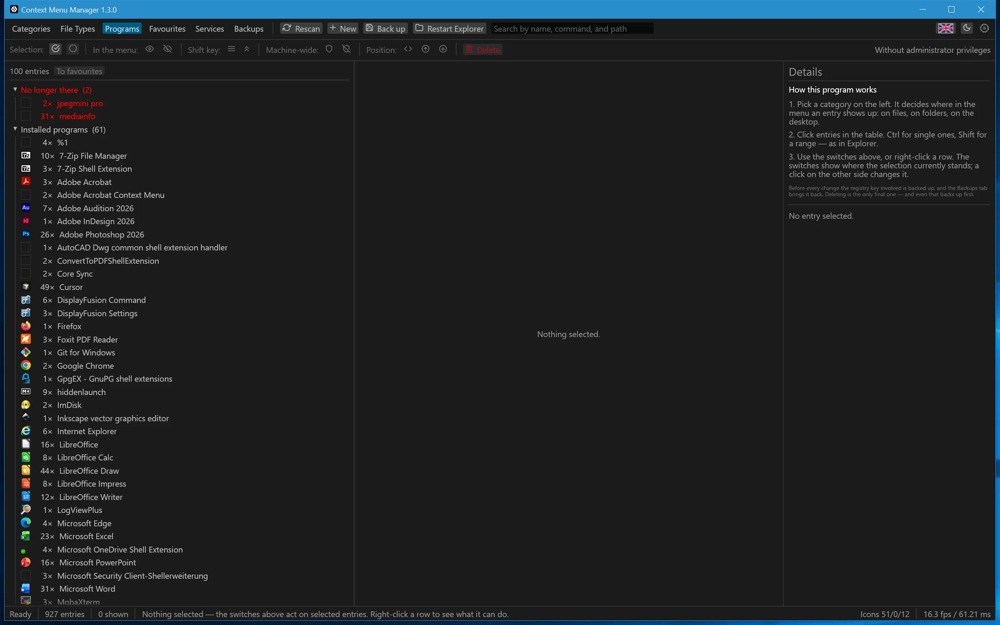
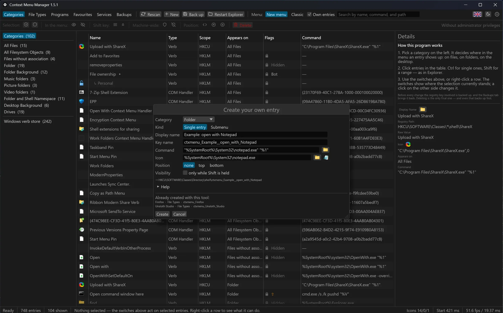
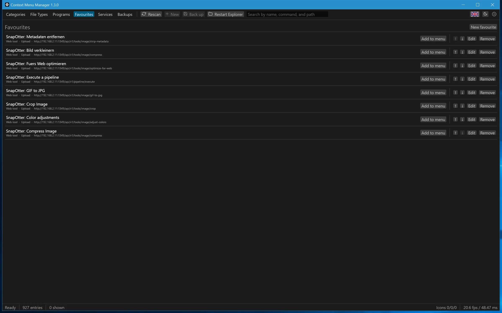
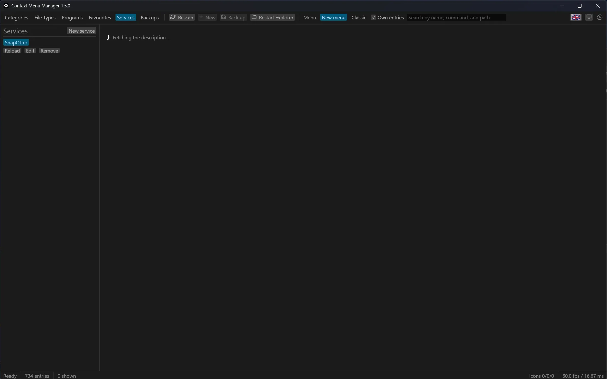
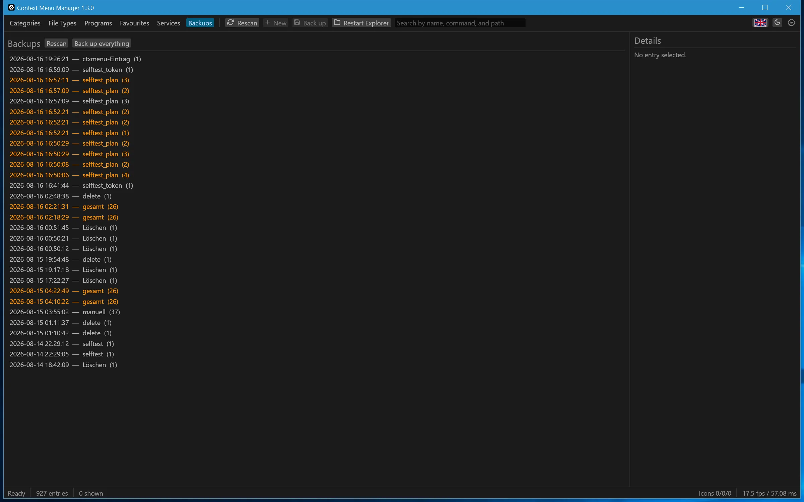
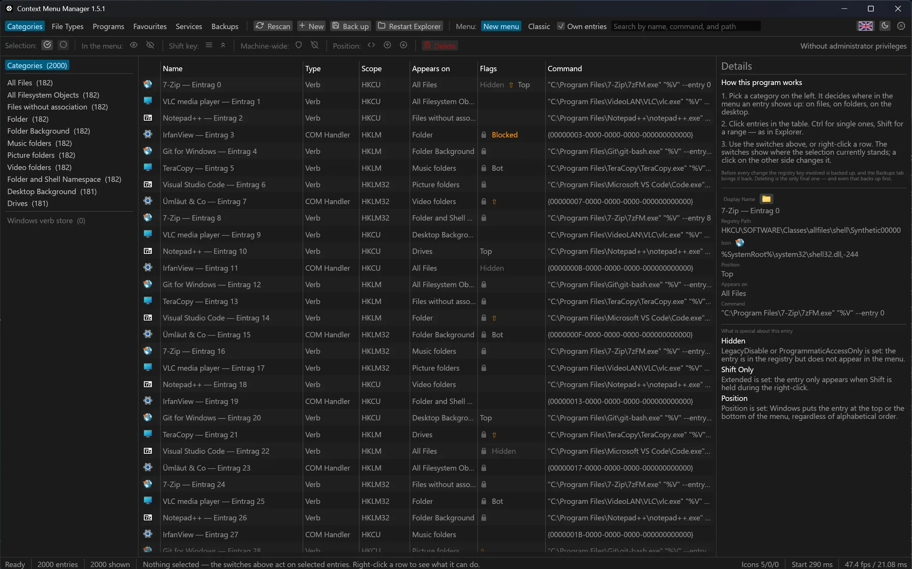

# ctxmenu: Windows-Kontextmenü-Manager

*[English version](../README.md)*

Ein Werkzeug für das Windows-Rechtsklickmenü: es zeigt, was darin steckt, wo es
in der Registry sitzt und zu welchem Programm es gehört — und lässt Einträge
ausblenden, nur mit Umschalttaste zeigen, sortieren, löschen und neu anlegen.
**Vor jeder Änderung wird gesichert**, und zwar nicht als Vorsatz, sondern weil
die Löschfunktion ohne Sicherungsnachweis gar nicht aufrufbar ist.

Und es geht in die andere Richtung: eigene Einträge, Untermenüs, ein
Werkzeugkasten aus Programmen und Web-Diensten — bis hin zu **zweihundert
Werkzeugen aus einer einzigen Adresse**, wenn eine Webanwendung sich selbst
über OpenAPI beschreibt.

Windows 10 und 11, 64 Bit. Eine einzelne `.exe`, in Rust geschrieben, ohne Installation,
ohne Laufzeitbibliothek, ohne Dienst im Hintergrund.

*A manager for the Windows context menu. German and English interface,
switchable at runtime; this README is German only.*



*Der Ausgangspunkt auf einer über die Jahre gewachsenen Maschine: 927 Einträge,
131 davon in den sieben Basis-Kategorien, weitere 229 in Windows' eigenem
Verbvorrat. Statische Verben und COM-Handler stehen nebeneinander; das Schloss
markiert, was sich ohne Administratorrechte nicht ändern lässt.*

---

## Was es kann

- **Alles sehen.** Die sieben Basis-Kategorien (Dateien, Ordner,
  Ordner-Hintergrund, Desktop-Hintergrund, Laufwerke, Dateisystemobjekte und
  der Shell-Namensraum) über drei Registry-Bereiche: `HKCU`, `HKLM` und die
  32-Bit-Sicht `WOW6432Node`. Auf einer gewachsenen Maschine kommen diese
  sieben auf rund 130 Einträge; löst man zusätzlich jeden Dateityp auf,
  erreicht der ganze Scan rund 930. Statische Verben und COM-Handler getrennt
  ausgewiesen: ein Verb ist ein Schlüssel mit einem Befehl, ein COM-Handler
  eine CLSID, hinter der eine DLL steckt, und für den Handler zeigt das
  Programm den Klarnamen der CLSID und die DLL dahinter. Dazu Windows' eigener
  **Verbvorrat** (`CommandStore`) — 229 Verben auf dieser Maschine, die in
  keinem Menü stehen, bis ein anderer Eintrag sie in seiner `SubCommands`-Liste
  nennt. Nur lesbar, mit Schloss gekennzeichnet.
- **Dateitypen auflösen.** Für eine Erweiterung wie `.jpg` die vollständige
  Kette aus Benutzerwahl, ProgID, `PerceivedType` und `SystemFileAssociations`,
  sieben Ebenen insgesamt — also das, was der Rechtsklick tatsächlich anzeigt,
  nicht das, was an einer Stelle eingetragen ist. Für `.jpg` sind das 58
  Einträge, 39 davon gelten für jede Datei — und weil diese zwei Drittel bei
  jeder Endung dieselben sind, lässt der Reiter sie weg, bis *Einträge für alle
  Dateien einschließen* sie anfordert.
- **Eigene Dateiendungen und der Vollscan.** Der Reiter *Dateitypen* zeigt
  eine kuratierte Auswahl von 98 Typen; ein Feld darüber nimmt jede weitere
  Endung auf, die dann gespeichert bleibt. Wer alles sehen will, drückt
  *Alle installierten* — auf einem gewachsenen Rechner sind das weit über
  tausend Typen statt 98; auf dem, an dem das hier entsteht, 1674. Entsprechend
  länger dauert das Einlesen.
- **Nach Programm gruppieren.** Ein Programm, das sich in zwanzig Dateitypen
  einträgt, erscheint als **eine** Gruppe mit allen Vorkommen — mit seinem
  Symbol davor. Der Name kommt aus der Versionsressource der `.exe`, nicht aus
  dem Schlüsselnamen. **Zeigt ein Eintrag auf ein Programm, das es nicht mehr
  gibt, steht die Zeile in Rot**; das passiert vor allem nach Updates von
  Store-Apps, deren Ordner die Versionsnummer im Namen trägt.
- **Ändern, in fünf Stufen von sanft nach hart:** ausblenden
  (`LegacyDisable`), nur mit Umschalttaste zeigen (`Extended`), Position auf
  oben oder unten setzen, COM-Handler systemweit blockieren, löschen.
- **Eigene Einträge anlegen** mit Anzeigename, Befehl, Symbol, Position und
  Umschalt-Sichtbarkeit — für eine Basis-Kategorie, für eine einzelne Endung
  oder für eine ganze Art von Datei. Neben dem Befehls- und dem Symbolfeld
  öffnen Durchsuchen-Knöpfe den gewöhnlichen Windows-Dateidialog und setzen in
  Anführungszeichen, was zurückkommt; das Symbol, auf das ein Verweis
  hinausläuft, wird neben dem Feld gezeichnet, ein falscher Index fällt also
  auf, bevor der Eintrag entsteht; der Registry-Pfad, in dem der Eintrag landen
  wird, steht unter dem Formular und folgt dem, was getippt wird; und eine
  aufklappbare *Hilfe* trägt die Platzhaltertabelle und drei funktionierende
  Befehlszeilen. Immer in `HKCU`, also ohne Administratorrechte und ohne Risiko
  für andere Konten.
- **Auch als Untermenü.** Statt eines Befehls bekommt der Eintrag eine Liste
  von Untereinträgen, die im Menü aufklappt. Die Reihenfolge im Formular ist
  die im Menü — Windows sortiert Registry-Schlüssel alphabetisch, deshalb
  nummeriert das Werkzeug sie beim Schreiben durch.
- **Favoriten: der Werkzeugkasten.** Ein Programm oder ein Webtool einmal
  eintragen, und es bleibt. Von dort aus landet es mit einem Klick in jeder
  Kategorie oder bei einem bestimmten Dateityp. Aus dem Reiter *Programme*
  wandert ein Programm, das ohnehin ständig auftaucht, mit einem Klick in die
  Liste.
- **Webtools als Favorit.** Ein Favorit muss keine `.exe` sein, eine Adresse
  genügt. Weil eine Webseite keine lokale Datei lesen darf, wird sie
  *geschickt* — dazu unten mehr.
- **Dienste: zweihundert Werkzeuge aus einer Adresse.** Beschreibt eine
  Webanwendung sich selbst über OpenAPI, genügt die Adresse ihrer
  Dokumentationsseite. Das Programm sucht das maschinenlesbare Dokument dahinter,
  liest heraus, welche Endpunkte eine Datei annehmen, gruppiert sie so, wie der
  Dienst sie selbst gruppiert, und macht aus jedem angekreuzten einen Favoriten.
  Nimmt ein Werkzeug Einstellungen an, entsteht ein Formular dafür — auch dann,
  wenn der Dienst seine Optionen nur als Fließtext beschreibt.
- **Ziehen und Ablegen.** Eine `.exe` ins Fenster ziehen öffnet den Editor,
  schon aus ihr gefüllt — Name, Befehl mit dem richtigen Platzhalter, das
  eigene Symbol des Programms; über welcher Kategorie sie fällt, entscheidet,
  in welcher das Formular beginnt. Geschrieben wird nichts, bis der Knopf im
  Formular gedrückt ist. Im Editor nehmen auch die Felder für Befehl und Symbol
  eine abgelegte Datei entgegen.
- **Sichern und zurückholen.** Jede Aktion legt vorher ein Backup an, eine
  Gruppenaktion genau eines für die ganze Gruppe. Ein Knopf **Sichern** in der
  oberen Leiste legt auf Zuruf eines an und ändert dabei nichts: die
  ausgewählten Zeilen, oder alles gerade Gelistete, wenn nichts ausgewählt ist.
  Der Reiter *Sicherungen* zeigt den Verlauf und spielt zurück — und hat einen
  Knopf **Alles sichern**, der jeden Ort mitnimmt, den dieses Werkzeug
  überhaupt anfasst (auf dieser Maschine 1,2 MB in unter einer Sekunde).
- **Untermenüs** werden mit ihren Kindern angezeigt, eingerückt unter dem
  Eintrag, in dem sie hängen.
- **Einen Eintrag ansehen:** Doppelklick auf eine Zeile — oder Rechtsklick,
  *Eintrag ansehen* — öffnet das Formular mit allem, was wirklich in der
  Registry steht.
- **Sich selbst aktualisieren.** Eine Anfrage beim Start, ob es eine neuere
  Fassung gibt; wenn ja, ein Punkt am Logo-Knopf und die Neuigkeiten im
  Über-Fenster. Geholt und ersetzt wird erst nach einem zweiten Klick, und nur,
  wenn Signatur und Prüfsumme der neuen Datei stimmen. Ohne Konto, ohne
  Telemetrie, abschaltbar.
- Deutsch und Englisch, hell und dunkel oder „System folgen" — beides ohne
  Neustart, die Titelleiste zieht mit.

## Was es bewusst nicht kann

- **Den Text eines COM-Handlers ändern.** Der entsteht zur Laufzeit in
  `IContextMenu::QueryContextMenu` und steht nirgends in der Registry. Gezeigt
  werden Schlüsselname, Klarname der CLSID und die DLL dahinter.
- **Das neue Windows-11-Hauptmenü umbauen.** Das Werkzeug arbeitet am
  klassischen Menü („Weitere Optionen anzeigen"), das Windows 11 weiterhin
  vollständig führt. Was es sehr wohl kann: den Explorer ganz auf dieses
  klassische Menü umstellen — siehe *Loslegen*.
- **Die Reihenfolge frei bestimmen.** Windows sortiert die Unterschlüssel
  alphabetisch und kennt nur die groben Blöcke `Position=Top` und
  `Position=Bottom`. Beides ist nachgemessen; mehr gibt das System nicht her.
- **Gescannte Einträge bearbeiten.** Das Formular zeigt alles, was in der
  Registry steht, schreibt aber noch nichts zurück. Selbst angelegte Einträge
  sind davon nicht betroffen.

---

## Loslegen

Es gibt keinen Installer. Die `.exe` starten reicht.

```
ctxmenu.exe
```

Ohne Argumente öffnet sich das Fenster. Ganz ohne Administratorrechte —
angefragt werden sie erst, wenn eine Änderung sie wirklich braucht, und dann
nur für diesen einen Schritt.

### Die sechs Reiter

| Reiter | Wofür |
|---|---|
| **Kategorien** | Der Einstieg: was bei Rechtsklick auf Ordner, Dateien, Desktop erscheint |
| **Dateitypen** | Eine Erweiterung wählen und die vollständige Auflösungskette sehen |
| **Programme** | Nach Programm gruppiert — der schnellste Weg, ein Programm ganz aus dem Menü zu nehmen |
| **Favoriten** | Der eigene Werkzeugkasten: einmal eintragen, immer da |
| **Dienste** | Werkzeuge aus der Selbstbeschreibung einer Webanwendung übernehmen |
| **Sicherungen** | Verlauf aller Sicherungen, mit Knopf zum Zurückspielen |

Das Suchfeld durchsucht Anzeigename, Befehl und Registry-Pfad — bei einem
COM-Handler zusätzlich seine CLSID und die DLL dahinter —, und ein Treffer im
Kind eines Untermenüs zählt für den Eintrag, an dem es hängt. Es greift auf den
drei Reitern, die gescannte Einträge zeigen (Kategorien, Dateitypen,
Programme), auch dann, wenn links noch nichts ausgewählt ist. Der Reiter
*Dienste* bringt eine eigene Suche über der Werkzeugliste mit; Favoriten und
Sicherungen sind kurz genug, um ganz gezeigt zu werden.



*Ein getipptes `git` lässt einen von 927 Einträgen stehen, und die rechte Seite
sagt, wo er wohnt: `Directory\Background\shell\git_shell`, unter `HKCU`, mit
`%V` statt `%1`, weil er am Ordner-Hintergrund hängt.*



*`.png` aufgelöst: 27 Einträge, eingesammelt aus der Endung selbst, ihrer
ProgID und `image` als wahrgenommenem Typ — kein einzelner Registry-Schlüssel
hält diese Liste. Die Einträge, die für jede Datei gelten, bleiben weg, bis
„Auch Einträge für alle Dateien" über dem Baum sie anfordert. Das Feld
darunter nimmt jede weitere Endung; „Alle installierten" tauscht die kuratierten
98 Typen gegen jeden auf der Maschine registrierten.*

### In der Liste

Pfeiltasten bewegen die Auswahl, Pos1 und Ende springen an Anfang und Ende, mit
gedrückter Umschalttaste wächst die Auswahl, Strg+A nimmt alles. Ein Klick auf
eine Spaltenüberschrift sortiert danach, ein zweiter dreht die Richtung um, und
ein dritter stellt die Reihenfolge wieder her, in der die Zeilen eingesammelt
wurden — was etwas wert ist: in *Dateitypen* stehen dann die Einträge der
gewählten Endung vor denen, die für jede Datei gelten. *Merkmale* und die
Symbolspalte sortieren nicht; eine Reihe von Zeichen hat keine Ordnung, die den
Klick lohnt. Die Spalte **Erscheint bei** sagt in Worten, wo ein Eintrag
auftaucht — „Alle Dateien" statt `*`, „.zip" statt eines Pfads mit
`SystemFileAssociations` in der Mitte; der echte Registry-Pfad steht im Tooltip.
Ein **Rechtsklick** bietet überall genau die Aktionen an, die für das
Angeklickte etwas ändern würden; bei Mehrfachauswahl fallen die weg, die nur
für einen Eintrag Sinn ergeben, und im leeren Bereich unter der Tabelle steht *Neu*. Auch die
Bäume links antworten auf einen Rechtsklick, jeweils mit dem Ziel, für das sie
stehen: eine Kategoriezeile legt in dieser Kategorie an, eine Zeile im
Dateityp-Baum nur für diese Endung — der kürzeste Weg zu „dieser Eintrag, aber
nur für `.png`".



*Ein COM-Handler, aufgeschlagen: Registry-Pfad, CLSID, die DLL dahinter und
drei kurze Gründe, warum sich hier nichts bearbeiten lässt — der Schlüssel
gehört `HKLM`, der Text entsteht zur Laufzeit, und der Eintrag ist für dieses
Konto nur lesbar.*

**Explorer neu starten** sitzt in der oberen Leiste. Windows liest die
Kontextmenü-Schlüssel beim Start des Explorers; ein Eintrag, der partout nicht
auftauchen will, braucht das.

**Das Windows-11-Menü abschalten.** Auf Windows 11 trägt die obere Leiste einen
Schalter mehr: *Menü: Windows 11 | klassisch*. „Klassisch" stellt das volle
Windows-10-Menü wieder her, mit allen Einträgen auf einmal statt der Hälfte
hinter „Weitere Optionen anzeigen". Es ist ein einziger Schlüssel im eigenen
Konto — keine Administratorrechte, niemand sonst betroffen — und er greift beim
nächsten Start des Explorers, den das Programm gleich anbietet. Auf Windows 10
fehlt der Schalter, weil es dort nichts umzuschalten gäbe.

### Eine typische Runde

1. Reiter **Programme**, das Programm anklicken, das stört.
2. Rechts prüfen, was daran hängt: Registry-Pfad, Rohwert, Befehl oder CLSID
   und DLL, wo es erscheint, und die Kinder eines Untermenüs. Jedes Feld lässt
   sich markieren und kopieren. Ein Ordnerknopf neben dem Namen öffnet den
   Explorer mit dem Programm selbst markiert, und jedes Zeichen, für das die
   Tabelle Platz hatte — das Schloss, der Pfeil, das Umschaltzeichen —, steht
   weiter unten in Worten.
3. **Ausblenden** statt Löschen. Das ist umkehrbar und reicht fast immer.
4. Wenn Windows nach Administratorrechten fragt: das sind die Einträge unter
   `HKLM`, also die für alle Konten. Wer ablehnt, behält die Änderungen an den
   eigenen Einträgen; die anderen bleiben, wie sie waren.



*Nach Programm gruppiert statt nach Schlüssel: ein Editor hält 49 Einträge,
LibreOffice Draw 44. Oben in Rot stehen zwei Programme, die nicht mehr
installiert sind und deren 33 Einträge noch im Menü stehen.*

---

## Sich selbst aktualisieren

Es gibt keinen Installer, also auch nichts, was von sich aus bemerkt, dass diese
Fassung alt geworden ist. Das Programm fragt deshalb selbst nach: einmal beim
Start, mit einer Anfrage an

```
https://api.github.com/repos/corgan2222/context-manager/releases/latest
```

Ohne Konto, ohne Kennung, ohne Anmeldung. Schlägt die Anfrage fehl — kein Netz,
ein Proxy dazwischen, GitHub gerade nicht erreichbar —, passiert sichtbar
nichts: der Zustand steht im Über-Fenster, der Fehler im Protokoll. Ein
Programm, das beim Start ein Fenster mit „GitHub nicht erreichbar" aufmacht,
ist eines, das man abschaltet.

Gibt es eine neuere Fassung, die sich auch installieren lässt, erscheint ein
kleiner Punkt in der Ecke des Logo-Knopfes rechts in der Werkzeugleiste, und der
Tooltip nennt die Nummer.
Draußen passiert nicht mehr als das: In einer Leiste aus lauter Symbolen ist für
einen Satz kein Platz, und ein Fenster, das sich ungefragt öffnet, um eine
Versionsnummer mitzuteilen, lernt man wegzuklicken. Alles Weitere steht im
Über-Fenster (Klick auf das Logo) unter der Überschrift **Aktualisierung**, von
oben nach unten: das Ankreuzfeld **Beim Start nach neuen Fassungen sehen**;
darunter, wenn etwas gefunden wurde, die Fassungsnummer, unter **Was neu ist**
die Release-Notizen und der Knopf **Holen und neu starten**; und zuletzt **Jetzt
nachsehen**.

**Erst dieser zweite Klick lädt etwas herunter.** Geprüft wird dann in dieser
Reihenfolge, und die Reihenfolge ist der ganze Punkt:

1. `checksums.txt` holen — die Liste der Dateien der Veröffentlichung mit ihren
   SHA-256-Prüfsummen. Sie selbst steht nicht darin, und ihre Signatur auch
   nicht; alles andere schon.
2. `checksums.txt.sig` holen.
3. Die Signatur prüfen: RSA, PKCS#1 v1.5 über SHA-256, gegen den öffentlichen
   Schlüssel, der in die laufende `.exe` einkompiliert ist — 4096 Bit, im
   Repositorium als `ctxmenu\release-signing.pub.pem` nachzulesen. Gerechnet
   wird dabei nichts von Hand: die RSA-Arithmetik übernimmt Windows' eigenes
   CNG. Stimmt die Signatur nicht, endet es hier.
4. Prüfen, dass diese Liste zu der Fassung gehört, die angeboten wird. Die
   Signatur deckt die Prüfsummen ab und sonst nichts — nicht den Tag, nicht
   die Veröffentlichung, an der er hängt. Ohne diesen Schritt könnte jemand,
   der das GitHub-Konto hat, die echt signierten Dateien einer alten Fassung
   an eine Veröffentlichung mit dem Tag `v99.0.0` hängen; alles Weitere ginge
   durch, und eine längst geschlossene Lücke käme zurück. Was es verhindert,
   steht schon in der Liste: das Archiv neben der `.exe` trägt die Fassung im
   Namen, und eine Zeile für `ctxmenu_<angebotene Fassung>_windows_amd64.zip`
   kann nur in einer Liste stehen, die für genau diese Fassung signiert wurde.
   Das Archiv selbst wird nie geholt; gebraucht wird nur sein Name.
5. Aus der damit als echt *und* als zu dieser Fassung gehörig erwiesenen Liste
   die Prüfsumme für `ctxmenu.exe` lesen.
6. Die `.exe` holen und nur annehmen, wenn ihre SHA-256 genau diese ist.

Zwei Dinge müssen also stimmen, und wer etwas unterschieben will, braucht beide:
das TLS-Zertifikat von GitHub, das WinHTTP gegen den Zertifikatspeicher von
Windows prüft, und die Unterschrift des Autors. Der private Schlüssel dazu liegt
im GitHub-Secret `RELEASE_SIGNING_KEY` und nicht im Repositorium. Das ist die
Hälfte, die auch dann noch trägt, wenn das GitHub-Konto es nicht mehr tut: Wer
eine Veröffentlichung anlegen kann, kann sie deswegen noch nicht unterschreiben.

Ersetzt wird über zwei Umbenennungen, denn Windows überschreibt eine laufende
Datei nicht, umbenennen lässt es sie aber. Die neuen Bytes werden als
`ctxmenu.exe.new` daneben geschrieben, die laufende Datei heißt dann kurz
`ctxmenu.exe.old`, und anschließend rückt `.new` auf den Originalnamen. Der
Download liegt zu diesem Zeitpunkt vollständig auf der Platte; die einzige
Lücke, in der unter dem Originalnamen keine Datei steht, ist die zwischen den
beiden Umbenennungen. Danach startet das Programm die neue Datei mit denselben
Argumenten und schließt sein Fenster — daher der Satz „Das Fenster schließt sich
und öffnet sich neu". `ctxmenu.exe.old` räumt der nächste Start weg.

Liegt die `.exe` in einem Ordner, in den dieses Konto nicht schreiben darf, etwa
unter `C:\Program Files`, misslingt das, und die Meldung sagt genau das statt
„Zugriff verweigert": „hier darf dieses Konto nicht schreiben; das Programm aus
einem eigenen Ordner starten oder die neue Fassung von Hand herunterladen".

**Was nicht passiert.** Kein Dienst und keine geplante Aufgabe im Hintergrund —
gefragt wird beim Start des Fensters und sonst nur, wenn jemand **Jetzt
nachsehen** drückt. Keine Telemetrie: Hinaus
geht eine Anfrage nach der letzten Veröffentlichung, und das Einzige, was sie
über den Absender sagt, ist `User-Agent: ctxmenu/<fassung>`. Kein Download ohne
den zweiten Klick, keine Installation, die von allein anläuft. Wer auch diese
eine Anfrage nicht möchte, nimmt den Haken bei **Beim Start nach neuen Fassungen
sehen** heraus (Vorgabe: gesetzt); das steht sofort in `settings.json`, nicht
erst beim Schließen des Fensters. Der Knopf **Jetzt nachsehen** arbeitet
weiterhin, denn ihn zu drücken ist genau die Entscheidung, die der Haken sonst
trifft.

**Was nicht angeboten wird.** Eine Veröffentlichung ohne `checksums.txt.sig` —
das sind alle vor 1.4.0 — bekommt nie einen Knopf zum Holen. Ein Satz Dateien,
der unvollständig eintreffen darf, ist einer, den jemand unvollständig machen
kann. Sie verschwindet dabei nicht aus dem Fenster: sie erscheint mit demselben
Satz wie eine, deren Dateien noch hochladen — von außen ist beides dasselbe,
nämlich eine Fassung, die es gibt und die dieses Programm nicht installiert. Und
in den Minuten nach einer Veröffentlichung, in
denen GitHub den neuen Tag schon nennt und der Bauauftrag die Dateien noch
hochlädt, sagt das Fenster genau das: die Fassung sei „angekündigt, aber noch
nicht fertig veröffentlicht. In ein paar Minuten noch einmal nachsehen." „Das
ist die neueste Fassung" wäre dort schlicht falsch.

**Und was das alles nicht ersetzt.** Die `.exe` trägt weiterhin keine
Authenticode-Signatur; wer sie im Browser herunterlädt, bekommt weiterhin die
Warnung von SmartScreen. Die Signatur über `checksums.txt` ist etwas anderes:
Authenticode ist, was Windows prüft, bevor es eine heruntergeladene Datei
ausführt, die Release-Signatur ist, was dieses Programm prüft, bevor es sich
selbst ersetzt. Keins der beiden steht für das andere ein.

---

## Einen Eintrag ändern

Fünf Stufen, von sanft nach hart:

| Stufe | Was passiert | Umkehrbar |
|---|---|---|
| **Ausblenden** | `LegacyDisable` an einem Ort | ja |
| **Nur mit Umschalttaste** | `Extended`, der Eintrag erscheint bei ⇧+Rechtsklick | ja |
| **Position** | `Position=Top` oder `Bottom` | ja |
| **Systemweit sperren** | Die CLSID kommt in die Sperrliste, für alle Konten | ja |
| **Löschen** | Der Schlüssel verschwindet | nur aus der Sicherung |

**Vor jeder Änderung wird gesichert.** Das ist keine Absichtserklärung: `delete_tree`
verlangt ein Token, und ein Token entsteht nur als Rückgabewert einer geglückten
Sicherung. Ohne Sicherung ist die Löschfunktion nicht aufrufbar.

**Eine Sicherung je Gruppenaktion**, nicht eine je Eintrag. Zwanzig Einträge auf
einmal ausblenden legt ein Verzeichnis an, nicht zwanzig.

**Erhöhte Rechte nur, wenn nötig.** Einträge unter `HKLM` verlangen sie; das
Programm fragt für genau diesen Schritt und startet sich dafür einmal neu. Wer
ablehnt, behält die Änderungen an den eigenen Einträgen.

**Die Aktionsleiste** über der Tabelle ist kein Satz Knöpfe, sondern vier
Schalter: *Im Menü* (sichtbar ↔ versteckt), *Umschalttaste* (immer ↔ nur mit ⇧),
*Systemweit* (frei ↔ gesperrt) und *Position*. Hervorgehoben ist, wo die Auswahl
gerade steht; ein Klick auf die andere Seite führt dorthin. Aus „welchen Knopf
drücke ich?" wird „wohin soll es?". Bei gemischter Auswahl leuchtet nichts, und
der Tooltip nennt die Zahlen. Was gerade nicht geht, ist grau und sagt im
Tooltip warum — etwa, dass keiner der ausgewählten Einträge ein COM-Handler ist
und es deshalb nichts zu sperren gibt. Neben den Schaltern sitzen die zwei
Auswahlknöpfe, und ganz am Ende, hinter einem Trenner und in Rot, **Löschen** —
das einzige Bedienelement der Leiste, das sein Wort behält, statt zu einem
Symbol zu schrumpfen. Rechtsbündig sagt die Leiste, ob dieser Lauf
Administratorrechte hat. Auf den Reitern Favoriten, Dienste und Sicherungen wird
sie gar nicht erst gezeichnet.

*Neu* in der oberen Leiste, oder ein Rechtsklick in den leeren Bereich, öffnet
dasselbe Formular andersherum: nicht einen Eintrag ändern, sondern einen
schreiben.



*Das Formular nennt den Schlüssel, den es schreiben wird, bevor es ihn schreibt,
bietet „Untermenü" statt „Einzelner Eintrag" für eine ganze Liste von Kindern und
führt darunter auf, was dieses Werkzeug bereits angelegt hat — damit nichts
zurückbleibt, an dessen Entstehen sich niemand erinnert.*

---

## Favoriten und Webtools

Der Reiter **Favoriten** ist eine Liste, die bleibt — und zwar in der
Reihenfolge, in die man sie bringt: jede Zeile trägt *Ins Kontextmenü*, zwei
Pfeile zum Verschieben nach oben und unten, *Bearbeiten* und *Entfernen*, und
diese Reihenfolge wird gespeichert. Die Tastatur genügt dafür auch — Pfeile,
Pos1 und Ende bewegen den Cursor, die Eingabetaste setzt den Favoriten, Entf
nimmt ihn heraus. Was einmal darin steht, lässt sich jederzeit an einer weiteren
Stelle im Kontextmenü eintragen, ohne es noch einmal einzurichten. „Ins
Kontextmenü" fragt nur noch nach dem Wo: eine der Basis-Kategorien, eine
Dateiendung (`.png`), oder eine ganze Art von Datei (`image` erfasst jedes
Bildformat, das Windows kennt).



*Acht Webtools, die bleiben. Jede Zeile behält ihre Betriebsart — hier
„Hochladen" — und ihren Endpunkt; „Ins Kontextmenü" ist der einzige Schritt, der
je wiederholt werden muss, und auch nur, um das Wo zu sagen.*

Ein Favorit muss kein Programm sein. Wenn das Werkzeug im Browser lebt, gibt
es ein Problem, das keine Registry löst: **eine Webseite darf keine lokale
Datei lesen.** Eine Adresse wie `https://tool.example/?f=C:\bild.png` öffnet
zwar die Seite, aber die Datei kommt dort nie an — kein Browser erlaubt das,
und das ist auch gut so. Die Datei muss also verschickt werden, und dafür
braucht es einen Absender. Das ist dieses Programm: der Menüeintrag ruft
`ctxmenu --favourite <kennung> "%1"` auf und macht dann, je nach Betriebsart,
eines von drei Dingen.

**Zwischenablage** — die Datei landet in der Zwischenablage, die Seite geht
auf, ein Strg+V im Browser genügt. Das ist der Weg für alles, was gar keine
Schnittstelle anbietet: Squoosh, die TinyPNG-Seite, remove.bg. Kein Schlüssel,
kein Endpunkt, funktioniert auch bei Werkzeugen, die nie damit gerechnet
haben. Bei einer PNG liegt zusätzlich das Bild selbst in der Ablage, damit
auch Seiten zufrieden sind, die ein Bild statt einer Datei erwarten.

**Hochladen** — für Werkzeuge mit echtem Endpunkt. Die Datei geht per
`multipart/form-data` (Feldname einstellbar) oder pur als Rumpf hinaus,
Kopfzeilen für einen Schlüssel lassen sich mitgeben. Eine multipart-Anfrage
kann neben der Datei einfache Formularfelder tragen, und darin reisen die
Einstellungen eines Werkzeugs: ein Feld mit dem JSON-Block, den der Dienst
verlangt hat, oder ein Feld je Option, wenn der Dienst sie einzeln benennt. Was
zurückkommt, wird wahlweise neben der Originaldatei gespeichert (`bild.png` →
`bild.min.png`; das Original wird **nie** überschrieben), im Browser geöffnet,
oder nur gemeldet. Die Ergebnisadresse darf im `Location`-Kopf einer
geglückten Antwort oder in einem JSON-Feld wie `output.url` stehen.

**Umleitungen werden nicht verfolgt.** Ein `3xx` beendet die Anfrage und nennt
die Adresse, auf die es zeigte. Die Frage vor dem Hochladen hat einen Host
genannt; ein Dienst, der stattdessen woanders hinzeigt, verlangt eine
Entscheidung, die nie getroffen wurde. Ist die andere Adresse die richtige,
gehört sie in den Endpunkt.

**Ein eingereihter Auftrag wird abgewartet.** Ein ausgelasteter Dienst antwortet
mit einer Quittung statt mit einer Datei — einer `202`, oder einer `200`, die
`"async": true` trägt —, und welche der beiden kommt, hängt an seiner Auslastung
und nicht am Endpunkt; beim Anlegen des Favoriten lässt sich das also gar nicht
entscheiden. Das Programm liest die Auftragsnummer aus der Quittung, fragt den
Fortschrittspfad des Dienstes alle anderthalb Sekunden danach, höchstens zwei
Minuten lang, und speichert die fertige Datei dann so, als wäre sie sofort
gekommen. Meldet eine Antwort, dass der Auftrag gescheitert ist, endet das
Warten sofort, statt die Zeit abzulaufen. Verlangt ist dafür, dass die
Beschreibung einen Fortschrittspfad nennt und der Favorit sagt, wo die Antwort
die fertige Datei nennt.

**Adresse öffnen** — baut die Adresse aus Platzhaltern und öffnet sie, ohne
etwas zu übertragen. `{name}`, `{stem}`, `{ext}`, `{path}`, `{dir}` und
`{fileurl}`, alle korrekt kodiert. Für Suche, Wiki, Ticketformular.

**Vor dem ersten Hochladen wird gefragt.** Einmal je Werkzeug, mit Angabe von
Ziel und Dateigröße; die Antwort wird gemerkt — und sie lässt sich
zurücknehmen: das Formular des Favoriten sagt in einer Zeile, dass das Senden
für dieses Werkzeug bestätigt ist, und der Knopf daneben löscht das, sodass der
nächste Klick wieder fragt. Werkzeuge, die aus einem Dienst entstanden sind,
sind die Ausnahme, denn der Dienst wurde mit Adresse und Schlüssel in einem
bewussten Schritt eingerichtet: sie gelten von Anfang an als zugestimmt und
senden beim ersten Klick. Unverschlüsseltes `http://` lehnt das Programm ab,
solange es nicht für diesen Favoriten ausdrücklich erlaubt wurde — eine Datei im
Klartext durchs Netz zu schicken soll eine Entscheidung sein, keine
Voreinstellung. Für die Übertragung ist WinHTTP zuständig, also der Client von
Windows selbst: mit dem Systemzertifikatspeicher und den Proxy-Einstellungen,
die ohnehin gelten.

**Sechs Dateien, eine Frage und eine Meldung.** Windows liest einen
Menübefehl, der auf `"%1"` endet, als „einmal je Datei" — sechs markierte
Dateien starten also sechs Kopien dieses Programms, von denen keine etwas von
den anderen weiß. Sie stimmen sich deshalb ab: **eine** stellt die Frage vor dem
ersten Hochladen, die anderen fünf warten auf diese Antwort und richten sich
danach, ein Nein eingeschlossen — dann schickt keine von ihnen etwas. Am Ende
teilen sie sich **eine** Benachrichtigung statt sechs: der Name des Werkzeugs
als Kopf, die Dateinamen untereinander, fortgeschrieben mit jeder fertigen Datei
statt neu aufzupoppen. Eine einzelne Datei liest sich unverändert, mit dem
ganzen Satz und ohne Zähler. Eine Datei, die scheitert, behält ihre eigene
Meldung, denn der Grund ist mehr wert als die Ordnung. Und erreichen sich die
sechs nicht, dann fragt und meldet jede für sich: sechs Meldungen sind lästig,
eine nie verschickte Datei ist ein Fehler.

---

## Dienste: zweihundert Werkzeuge, eine Adresse

Einen Favoriten von Hand einzurichten heißt sechs Felder auszufüllen. Bei einem
selbst betriebenen Dienst mit zweihundert Werkzeugen ist das keine Arbeit, die
jemand macht.

Der Reiter **Dienste** nimmt deshalb die Adresse, die man ohnehin im Browser
offen hat — die API-Dokumentation, mitsamt Sprungmarke:

```
http://192.168.x.y:1349/api/docs/#tag/tools
```

Das Programm schneidet die Sprungmarke ab und sucht das maschinenlesbare
Dokument dahinter: die Seite selbst, dann `openapi.json`, `swagger.json`,
`/v3/api-docs` und die übrigen üblichen Orte, von diesem Pfad aus und von der
Wurzel. Der Statuscode entscheidet dabei nichts — eine Dokumentationsseite
antwortet ebenso mit 200 wie das Dokument. Ob sich die Antwort als JSON lesen
lässt, ist das Kriterium.

Aus der Beschreibung wird dann alles gelesen, was sich lesen lässt:

- **Welche Endpunkte überhaupt in Frage kommen** — die, die eine Datei als
  `multipart/form-data` annehmen. Alles andere kann ein Rechtsklick nicht
  bedienen. An einem Testdienst mit 351 Pfaden sind das 232.
- **Wie sie zusammengehören.** Nicht nach dem OpenAPI-`tag`: der lautet bei
  vielen Diensten für fast alles gleich. Stattdessen treten alle möglichen
  Gliederungen gegeneinander an, der Tag und jede Stelle des Pfades,
  gemessen an vier Größen: wie viel des Dienstes in brauchbaren Gruppen landet,
  wie gleichmäßig, wie nah die Gruppenzahl an der Wurzel aus der Gesamtzahl
  liegt, und ob die Werkzeugnamen das Gruppenwort wiederholen. Bei einem Dienst
  mit 232 Werkzeugen kommen so *Image, Video, PDF, Audio, Files* heraus — dazu
  zwei Ausreißer mit je einem Werkzeug — statt einer Schublade „Tools" mit 225
  Einträgen darin, und zwar mit Faktor 26.
- **Was ein Werkzeug außer der Datei annimmt.** Liefert die Beschreibung ein
  Schema, entsteht daraus ein Formular mit getippten Feldern: Zahl mit dem
  erlaubten Bereich im leeren Feld, Ankreuzfeld, Auswahlliste. Liefert sie
  keins, sondern nur Prosa — der häufigere Fall —, wird auch die gelesen,
  solange sie ihre Felder auflistet:

  ```
  JSON string with options:
  - `left` (number, required) - Left offset in pixels (min 0)
  - `unit` (string, optional) - One of: px, percent
  ```

  Daraus wird dasselbe Formular. Am Testdienst ergeben 113 von 227
  Options-Beschreibungen ein Formular mit zusammen 431 Feldern. Wo die Prosa
  nicht eindeutig ist, bleibt es beim Textfeld mit der Beschreibung darüber —
  lieber kein Feld als ein falsches, denn ein falsch erkanntes schickt Unsinn
  an einen echten Dienst, ein übersehenes kostet ein Ankreuzfeld.
- **Was ausgelassen wird.** Endpunkte, deren Beschreibung von vornherein sagt,
  dass sie ausschließlich einen Auftrag einreihen, stehen nicht in der Liste.
  Eine Auftragsantwort als solche ist keine Sackgasse mehr — sie wird
  abgewartet, siehe oben —, aber bei einem Endpunkt, der nie anders antwortet,
  müssen Fortschrittspfad und Einstellungen stimmen, bevor er das Anbieten wert
  ist, und eine Beschreibung allein belegt das nicht. Am Testdienst sind das 52
  von 232. Ihre Zahl steht trotzdem da, mit einem Knopf, der sie einblendet.

Angekreuzt wird einzeln oder kategorienweise, angelegt auf einen Schlag.



*Eine Adresse, ausgelesen: 180 brauchbare Werkzeuge, gruppiert so, wie der
Dienst sich selbst gruppiert — „Image" allein hält 81. „Einstellungen" öffnet
das aus den eigenen Optionen des Werkzeugs gebaute Formular, der Pfeil dessen
Seite in der Dokumentation des Dienstes. Die 52 Werkzeuge, die nur mit einer
Auftragsnummer antworten, stehen nicht in der Liste und werden darüber gezählt.*

Was ein Dienst über sich selbst sagt, steht danach in jedem Favoriten — die
Adresse, der Schlüssel, die Stelle, an der die Antwort die fertige Datei nennt —
und jedes Werkzeug hat einen Verweis auf seinen Platz in der Dokumentation des
Dienstes; **Adresse und Schlüssel bleiben lokal** in
`%LOCALAPPDATA%\ctxmenu\services.json` und gehen nirgendwohin. Weil jeder Favorit
seine eigene Kopie hält, erreicht eine spätere Änderung am Dienst die schon
erzeugten Werkzeuge nicht: dieselben noch einmal ankreuzen und ein zweites Mal
anlegen. Sie werden dabei ersetzt statt verdoppelt, und genau so zieht man einen
Dienst nach, der ein neues Werkzeug bekommen hat.

Zwei Felder kann keine Beschreibung liefern, weil sie von der Installation
abhängen: wo in der Antwort die fertige Datei genannt wird, und ob
unverschlüsseltes `http://` erlaubt sein soll. Dafür gibt es Vorlagen — ein
Klick füllt sie aus, die Adresse und der Schlüssel bleiben Ihre.

---

## Über die Kommandozeile

Dieselbe Anwendung ist auch ein Diagnosewerkzeug. Ausgaben landen in der
Konsole, aus der sie gestartet wurde, in der Sprache, auf die das Fenster
eingestellt ist — ein `--lang de` oder `--lang en` vor dem Befehl ändert das
für einen Lauf.

```
ctxmenu scan --category directory        Einträge einer Kategorie
ctxmenu scan --all-types --json          Vollscan inklusive Dateitypen, als JSON
ctxmenu scan --every-type                jede registrierte Endung statt der Auswahl
ctxmenu filetype .jpg                    Auflösungskette einer Erweiterung
ctxmenu programs                         nach Programm gruppiert
ctxmenu hide "<schlüssel>" --yes         ausblenden, mit Sicherung
ctxmenu show "<schlüssel>" --yes         das wieder zurücknehmen
ctxmenu shift-only "<schlüssel>" --yes   nur bei Umschalt+Rechtsklick
ctxmenu always-show "<schlüssel>" --yes  das wieder zurücknehmen
ctxmenu delete "<schlüssel>" --yes       löschen, mit Sicherung
ctxmenu backups                          Sicherungen auflisten
ctxmenu backup-all                       alles sichern, was das Werkzeug anfasst
ctxmenu restore "<verzeichnis>"          Sicherung zurückspielen
ctxmenu create --category directory --name "Mit Editor öffnen"
               --command "\"C:\Windows\notepad.exe\" \"%1\""
ctxmenu create --category directory --name "Werkzeuge"
               --sub "Öffnen|\"C:\Windows\notepad.exe\" \"%1\""
               --sub "Anzeigen|cmd /c dir \"%1\" & pause"
                                         Untermenü statt einem Befehl
ctxmenu created                          eigene Einträge auflisten
ctxmenu favourites                       Favoriten auflisten
ctxmenu favourite add --name "PNG verkleinern"
        --url https://squoosh.app --mode clipboard
ctxmenu favourite place <kennung> --ext .png
                                         auch --category oder --perceived
ctxmenu favourite remove <kennung>       einen aus dem Werkzeugkasten nehmen
ctxmenu favourite run <kennung> <datei>  ausführen wie ein Klick
ctxmenu --tab dienste                    Fenster auf einem bestimmten Reiter öffnen
ctxmenu --ext .png                       Dateitypen-Reiter, diese Endung gewählt
ctxmenu --search 7-zip                   das Fenster, mit ausgefüllter Suche
ctxmenu --service snapotter              Dienste-Reiter, dieser Dienst gewählt und geladen
ctxmenu --new directory                  Editor für einen neuen Eintrag, mit Beispiel gefüllt
ctxmenu --lang en scan                   diesen Lauf auf Englisch, Einstellung bleibt
ctxmenu --version                        welche Fassung das ist
ctxmenu --help                           die vollständige Liste der Befehle und Schalter
```

`<schlüssel>` ist der vollständige Pfad unterhalb einer Classes-Wurzel, so wie
`reg.exe` ihn schreibt: `HKCU\SOFTWARE\Classes\Directory\shell\MeinEintrag`.
Alles oberhalb dieser Wurzel wird abgelehnt, und ebenso jeder Pfad, der auf
einen Sammelschlüssel wie `shell` endet. Die schlichte `scan`-Tabelle druckt ihn
nicht — `ctxmenu scan --json` führt ihn als `registry_path`, und im Fenster
steht er im Detailbereich.

**Ohne `--yes` wird nichts geschrieben.** Der Befehl nennt dann nur den
Schlüssel, den er anfassen würde, und bei den vier Flag-Verben zusätzlich, ob
dieser Schritt Administratorrechte bräuchte. Das ist der billigste Weg, einen
von Hand getippten Schlüssel zu prüfen.

Eine Falle, und es ist Windows' eigene: die ausgelieferte `.exe` ist ein
Fensterprogramm, die Shell wartet also nicht auf sie, und
`ctxmenu scan --json > scan.json` lässt die Datei leer — nachgemessen, ohne dass
eine Fehlermeldung darauf hinwiese. Also die Ausgabe in der Konsole lesen, oder
sie mit `Start-Process ctxmenu -ArgumentList 'scan','--json' -Wait
-RedirectStandardOutput scan.json` einfangen.

Ein Hinweis zum Anlegen: In den Hintergrund-Kategorien (Ordner-Hintergrund,
Desktop) bleibt `%1` **leer**. Dort gehört `%V` hin. Das Werkzeug warnt davor,
denn ein Eintrag, der nichts tut, sieht aus wie ein Eintrag, der geht.

---

## Sichern und zurückholen

Jede Aktion legt vorher eine Sicherung an. Der Reiter **Sicherungen** zeigt den
Verlauf, sagt zu jeder, was darin steckt, und spielt sie zurück. Der Knopf
**Alles sichern** nimmt jeden Ort mit, den dieses Programm überhaupt anfasst:
auf dieser Maschine 26 von 46 Schlüsseln, 1,2 MB, unter einer Sekunde. Die
übrigen 20 gibt es hier nicht, 15 davon in der leeren 32-Bit-Ansicht.



*Eine Zeile je Aktion, mit der Zahl der Schlüssel dahinter in Klammern. Die
Zeilen, die 26 nennen, sind Gesamtsicherungen; der Rest stammt aus einzelnen
Änderungen und aus Testläufen auf der Entwicklungsmaschine.*

```
%LOCALAPPDATA%\ctxmenu\backups\<zeitstempel>_<aktion>\
    manifest.json      was gesichert wurde, wann, und was fehlte
    01_….reg           eine Datei je Schlüssel, von reg.exe geschrieben
%LOCALAPPDATA%\ctxmenu\entries.json     selbst angelegte Einträge
%LOCALAPPDATA%\ctxmenu\favourites.json  der Werkzeugkasten
%LOCALAPPDATA%\ctxmenu\services.json    eingetragene Dienste samt Schlüssel
%LOCALAPPDATA%\ctxmenu\settings.json    Sprache, Darstellung, ob beim Start
                                        nach neuen Fassungen gesehen wird
%LOCALAPPDATA%\ctxmenu\ctxmenu.log      jeder gezeigte Fehler und jeder Absturz
```

Das Protokoll ist im Über-Fenster verlinkt — und dieses Fenster tut noch etwas,
das der Erwähnung wert ist. Es bietet an, *dieses* Programm selbst in die Menüs
für Ordner-Hintergrund und Desktop-Hintergrund einzutragen, sagt zu jedem der
beiden, ob der Eintrag schon da ist, und nimmt ihn über denselben Knopf wieder
heraus. Es ist der eine Eintrag, den niemand von Hand schreiben kann, ohne
vorher zu wissen, wo seine eigene `.exe` liegt, und sein Entfernen wird wie
jedes andere Löschen gesichert.

Drei Dinge kommen noch dazu, geschrieben von einem Favoriten, der angeklickt
wird, und zwei weitere von einer Aktualisierung, die sich installiert:
`ctxmenu.exe.new` und `ctxmenu.exe.old`, beide neben der laufenden `.exe`, beide
binnen Sekunden wieder weg. Das erste der drei ist eine Verknüpfung im
Startmenü:

```
%APPDATA%\Microsoft\Windows\Start Menu\Programs\ctxmenu.lnk
```

Die Ordnernamen sind auch auf einem deutschen Windows englisch — „Startmenü" und
„Programme" sind das, was der Explorer anzeigt, nicht das, was auf der Platte
steht.

Eine Verknüpfung auf die laufende `.exe`, angelegt beim ersten Favoriten, der
sein Ergebnis meldet. Windows zeigt die Meldung eines Desktop-Programms nur
dann auf dem Bildschirm, wenn eine Verknüpfung im Startmenü dieselbe Kennung
trägt, unter der die Meldung verschickt wurde; ohne sie wird sie stillschweigend
im Info-Center abgelegt, und auf dem Bildschirm erscheint nichts. Was Windows
auf diesem Weg einmal gelernt hat, behält es allerdings: nachgemessen mit
wieder gelöschter Verknüpfung, kam das Banner trotzdem noch an. Löschen Sie sie also,
geht nichts kaputt, und der nächste Lauf legt sie ohnehin wieder an. Neu
geschrieben wird sie auch, wenn die `.exe` umzieht, damit der Eintrag nie auf
eine Datei zeigt, die es nicht mehr gibt.

Das zweite ist eine Merkdatei je Favorit und je Tag unter
`%TEMP%\ctxmenu-batch\`: drei Zeilen Text, die sagen, wann der Lauf begann, wie
die eine Frage beantwortet wurde und welche Dateien fertig sind. Das ist es,
worüber sich die sechs Prozesse eines Klicks abstimmen, es sind ein paar Dutzend
Byte, und der nächste Lauf an einem anderen Tag räumt sie weg. Das dritte ist
ein einzelner Registry-Wert,
`HKCU\SOFTWARE\Classes\AppUserModelId\ctxmenu.ContextMenuManager\DisplayName`,
aus dem Windows den Namen liest, den es über eine Benachrichtigung schreibt.

Die Schlüssel in `favourites.json` und `services.json` liegen dort im Klartext,
geschützt nur durch die Rechte auf Ihrem Benutzerprofil — wie in einer
`.npmrc` oder `.gitconfig` auch. Wer das nicht möchte, benutzt für dieses
Programm einen eigenen Schlüssel mit eingeschränkten Rechten.

Die `.reg`-Dateien sind gewöhnliche Registrierungsdateien: sie lassen sich auch
ohne dieses Werkzeug per Doppelklick zurückspielen. Eine Grenze hat das —
`reg import` fügt hinzu und überschreibt, es **entfernt nichts**. Nach einem
Löschen stellt es exakt den alten Zustand her; über einen inzwischen
veränderten Schlüssel gespielt, bleiben dessen neue Werte stehen.

Das Programm selbst geht einen Schritt weiter. Schlüssel, die es beim Sichern
noch gar nicht gab, stehen im `manifest.json` unter `absent` und werden beim
Zurückspielen wieder **entfernt** — anders ließe sich ein Blockieren nicht
rückgängig machen, denn die Blocked-Liste liefert Windows nicht mit, sie
entsteht erst mit dem ersten blockierten Handler. Für die Gesamtsicherung gilt
das ausdrücklich nicht: sie umfasst ganze Zweige wie `Directory\shell`, in die
auch jedes andere Programm schreibt, und nimmt beim Zurückspielen nichts weg.

Ein Zurückspielen bricht nicht mehr beim ersten fehlenden Schlüssel ab: jeder
Eintrag wird versucht, und am Ende steht, wie viele zurück sind und welche
nicht. Eine geteilte Aktion — ein Teil hier, ein Teil mit Administratorrechten —
legt zwei Sicherungen an; das Ergebnisfenster nennt beide und der Knopf
*Wiederherstellen* spielt beide ein.

---

## Geschwindigkeit

Gemessen auf dieser Maschine, vier Bildschirme mit 3840×2160: **714 bis 724 ms**
von der Prozesserzeugung bis zur ersten sichtbaren Liste mit 927 echten
Einträgen, und 1113 bis 1277 ms beim allerersten Lauf einer frisch gebauten
`.exe`. Eine Tabelle mit 2000 Zeilen zu scrollen kostet **im Mittel 16,7 ms je
Bild**, 18,5 ms im schlechtesten von 300 (`--synthetic 2000 --bench 300`).



*`--synthetic 2000` füllt die Tabelle mit erzeugten Zeilen, damit sich die Liste
beurteilen lässt, ohne eine Maschine zu besitzen, die wirklich so viele Einträge
hat. Die Merkmalsspalte zeigt alle vier Zustände nebeneinander: versteckt, nur
mit Umschalttaste, gesperrt, und nach oben oder unten angeheftet.*

---

## Selbst bauen

Vorausgesetzt sind Rust 1.95 und die Visual-Studio-Build-Tools mit
C++-Werkzeugkette.

```powershell
cargo build --release
cargo test
```

Das Ergebnis liegt unter `target\x86_64-pc-windows-msvc\release\ctxmenu.exe` —
nicht unter `target\release\`, weil `.cargo\config.toml` das Ziel ausdrücklich
nennt. Das ist Absicht: nur so gilt die statisch gebundene C-Laufzeit für die
Anwendung und nicht auch für die Makro-Bibliotheken des Übersetzers. Die
fertige Datei braucht deshalb kein „Visual C++ Redistributable" — nachgeprüft
auf einem frisch installierten Windows 10 ohne jede Zusatzsoftware.

536 Tests, `cargo clippy -- -D warnings` sauber.

Zurückgestellte Vorhaben, den Entwicklungsstand, die Messwerte und die Stellen,
an denen Windows sich anders verhält als dokumentiert, führt der Autor in
Notizen, die nicht Teil dieses Repositoriums sind.

---

## Mitmachen, Sicherheit, Lizenz

- [Mitmachen](../CONTRIBUTING.md) (englisch)
- [KI-Richtlinie](../AI_POLICY.md) (englisch)
- [Sicherheitsrichtlinie](../SECURITY.md) (englisch)
- [Verhaltenskodex](../CODE_OF_CONDUCT.md) (englisch)
- [Hinweise zu Fremdsoftware](THIRD-PARTY-NOTICES.md) (englisch)
- [MIT-Lizenz](../LICENSE)
